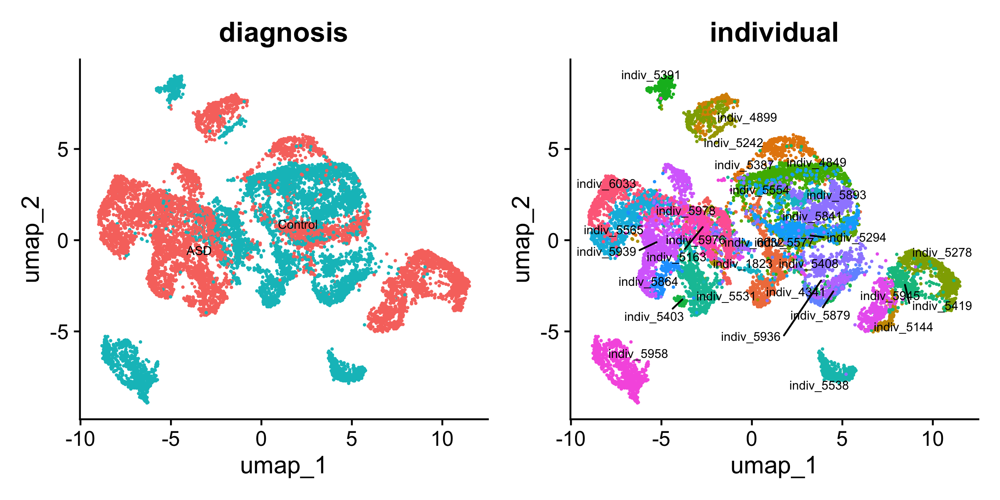

```{r setup, include=FALSE}
knitr::opts_chunk$set(echo = TRUE, message = FALSE, warning = FALSE)
```

# Overview

This article builds the Seurat object that the companion article
[Neuron analysis for Layer 2/3 in ASD](https://linnykos.github.io/eSVD2/articles/asd.html)
analyzes with eSVD-DE. It starts from the public count matrix of
Velmeshev et al. (2019) and ends with a Seurat object of 13,302 Layer 2/3
neurons and 6,599 genes, saved as `asd_seurat.RData`. The same file can be
downloaded from
[Dropbox](https://www.dropbox.com/scl/fi/csyz62obxx8xj5gl5sgp4/asd_seurat.RData?rlkey=d7dlhqjesunal52u8z2iomjsg&dl=0),
so this article is only needed if you want to see how it was made, or if you
cannot download it.

The heavy chunks below are not run when the site is built (`eval = FALSE`);
the printed output is pasted in from a run on 2026-09-30 with eSVD2 1.2.0 and
Seurat 5.5.1. That run reproduced the 2024 object exactly: the same cells,
the same genes and the same counts, so the file on Dropbox is unchanged.

| Stage | What it does | Functions |
|---|---|---|
| Read | Read the sparse matrix, gene symbols, barcodes and metadata | `Matrix::readMM()`, `utils::read.csv()` |
| Build | Create the Seurat object and keep the Layer 2/3 cluster | `Seurat::CreateSeuratObject()`, `subset()` |
| Filter | Drop all-zero genes, cells with too many counts, genes with too many counts | `Matrix::colSums()`, `subset()` |
| Select genes | Union of variable genes, the paper's L2/3 DEGs, housekeeping and SFARI genes | `Seurat::FindVariableFeatures()`, the data sets shipped with `eSVD2` |
| Save and look | Save the object; PCA and UMAP for a picture | `save()`, `Seurat::RunUMAP()`, `Seurat::DimPlot()` |

# Downloading the data

The data can be downloaded from
[https://cells.ucsc.edu/autism/rawMatrix.zip](https://cells.ucsc.edu/autism/rawMatrix.zip).
After unzipping `rawMatrix.zip` you get four files:

- `barcodes.tsv`: 104,559 rows (cells) and 1 column, the cells' barcodes
- `genes.tsv`: 65,217 rows (genes) and 2 columns, the Ensembl ID and the gene symbol
- `matrix.mtx`: a sparse matrix with 65,217 rows and 104,559 columns and about 238 million non-zero counts (3.3 Gb as text)
- `meta.txt`: 104,559 rows (cells) and 16 columns of covariates about each cell and donor

The original paper is
[Velmeshev et al. (2019)](https://pubmed.ncbi.nlm.nih.gov/31097668/).

# Setting up in R

You will need `Matrix`, `Seurat` and `eSVD2` (for the three gene lists it
ships). Point `data_dir` at the unzipped folder.

```{r libraries, eval = FALSE}
library(Matrix)
library(Seurat)

set.seed(10)
date_of_run <- Sys.time()
session_info <- sessionInfo()

# The folder that holds matrix.mtx, genes.tsv, barcodes.tsv and meta.txt.
# Change this line to wherever you unzipped rawMatrix.zip.
data_dir <- "/Users/kevinlin/Downloads/rawMatrix"
```

# Reading in the data

First, we read in the data. Reading the 3.3 Gb `matrix.mtx` with
`Matrix::readMM()` took about a minute on a 2023 MacBook Pro (Apple M2 Max,
32 Gb RAM) and needs about 14 Gb of memory at its peak. There are 6,143
duplicated gene symbols; for simplicity we keep the first occurrence of each.

```{r read_matrices, eval = FALSE}
mat <- Matrix::readMM(file.path(data_dir, "matrix.mtx"))
gene_mat <- utils::read.csv(file.path(data_dir, "genes.tsv"),
                            sep = "\t", header = FALSE)
cell_mat <- utils::read.csv(file.path(data_dir, "barcodes.tsv"),
                            sep = "\t", header = FALSE)
metadata <- utils::read.csv(file.path(data_dir, "meta.txt"),
                            sep = "\t", header = TRUE,
                            stringsAsFactors = TRUE)
metadata$individual <- factor(paste0("indiv_", metadata$individual))

rownames(mat) <- gene_mat[, 2]
colnames(mat) <- cell_mat[, 1]

# remove duplicates
if(any(duplicated(rownames(mat)))){
  mat <- mat[-which(duplicated(rownames(mat))), ]
}
dim(mat)

rownames(metadata) <- metadata$cell
metadata <- metadata[, setdiff(colnames(metadata), "cell")]
colnames(metadata)
```

```
[1]  59074 104559
 [1] "cluster"                      "sample"
 [3] "individual"                   "region"
 [5] "age"                          "sex"
 [7] "diagnosis"                    "Capbatch"
 [9] "Seqbatch"                     "post.mortem.interval..hours."
[11] "RNA.Integrity.Number"         "genes"
[13] "UMIs"                         "RNA.mitochondr..percent"
[15] "RNA.ribosomal.percent"
```

# Creating the Seurat object

Next, we create the Seurat object and keep only the cells in the Layer 2/3
cluster, 13,324 cells. (We abbreviate this Seurat object as `asd`, for
Autism Spectrum Disorder.)

```{r create_seurat, eval = FALSE}
asd <- Seurat::CreateSeuratObject(counts = mat,
                                  meta.data = metadata)

asd <- subset(asd, cluster == "L2/3")

asd[["percent.mt"]] <- Seurat::PercentageFeatureSet(asd, pattern = "^MT-")
asd
```

```
An object of class Seurat
59074 features across 13324 samples within 1 assay
Active assay: RNA (59074 features, 0 variable features)
 1 layer present: counts
```

# Preprocessing the Seurat object

We then do basic preprocessing: remove the genes with no counts at all in
these cells (21,105 of them), remove the cells with too many counts (22
cells with 60,000 or more), then remove the genes with too many counts (100
genes whose mean `log1p` count is above `log1p(10)`). After these three
filters 37,869 genes and 13,302 cells remain.

We then gather the genes we want eSVD-DE to analyze: the 5,000 most variable
genes, the DEGs that Velmeshev et al. reported for L2/3 neurons
(`velmeshev_gene_df`, 99 present), the housekeeping genes
(`housekeeping_df`, 944 present) and the SFARI autism genes (`sfari_df`,
1,056 present). The union, minus the mitochondrial genes, is 6,599 genes,
which we set as the variable features and subset to.

Once this is done, we are ready to perform the eSVD-DE analysis (in the
other article).

```{r filter, eval = FALSE}
set.seed(10)
mat <- SeuratObject::LayerData(asd, layer = "counts", assay = "RNA")
mat <- Matrix::t(mat)

# remove genes with all 0's
gene_sum <- Matrix::colSums(mat)
if(any(gene_sum == 0)){
  features <- SeuratObject::Features(asd)
  features <- setdiff(features, names(gene_sum)[which(gene_sum == 0)])
  asd <- subset(asd, features = features)
}

# remove cells with too high counts
keep_vec <- rep(TRUE, length(Seurat::Cells(asd)))
keep_vec[asd$nCount_RNA >= 60000] <- FALSE
asd[["keep"]] <- keep_vec
asd <- subset(asd, keep == TRUE)

# remove genes with too high counts
mat <- SeuratObject::LayerData(asd, layer = "counts", assay = "RNA")
mat <- Matrix::t(mat)
gene_total <- Matrix::colSums(log1p(mat))
gene_threshold <- log1p(10) * nrow(mat)
features <- colnames(mat)[which(gene_total <= gene_threshold)]
asd <- subset(asd, features = features)
asd
```

```
An object of class Seurat
37869 features across 13302 samples within 1 assay
Active assay: RNA (37869 features, 0 variable features)
 1 layer present: counts
```

```{r select_genes, eval = FALSE}
# find the variable genes
asd <- Seurat::NormalizeData(asd)
asd <- Seurat::FindVariableFeatures(asd,
                                    selection.method = "vst",
                                    nfeatures = 5000)

data("velmeshev_gene_df", package = "eSVD2")
de_genes <- velmeshev_gene_df[velmeshev_gene_df[, "Cell type"] == "L2/3",
                              "Gene name"]

data("housekeeping_df", package = "eSVD2")
hk_genes <- housekeeping_df[, "Gene"]

data("sfari_df", package = "eSVD2")
sfari_genes <- sfari_df[, "gene.symbol"]

gene_keep <- unique(c(
  de_genes,
  hk_genes,
  sfari_genes,
  Seurat::VariableFeatures(asd)
))
rm_idx <- grep("^MT", gene_keep) # remove mitochondrial genes
if(length(rm_idx) > 0) gene_keep <- gene_keep[-rm_idx]
gene_current <- SeuratObject::Features(asd)
gene_keep <- intersect(gene_current, gene_keep)
Seurat::VariableFeatures(asd) <- gene_keep
asd <- subset(asd, features = Seurat::VariableFeatures(asd))
asd
table(asd$individual, asd$diagnosis)
```

```
An object of class Seurat
6599 features across 13302 samples within 1 assay
Active assay: RNA (6599 features, 6599 variable features)
 2 layers present: counts, data
```

```
            ASD Control
indiv_1823    0      72
indiv_4341    0     733
indiv_4849  428       0
indiv_4899  349       0
indiv_5144  202       0
indiv_5163    0     145
indiv_5242    0      81
indiv_5278  944       0
indiv_5294  449       0
indiv_5387    0    1129
indiv_5391    0     237
indiv_5403   69       0
indiv_5408    0     162
indiv_5419  327       0
indiv_5531  631       0
indiv_5538    0     391
indiv_5554    0     233
indiv_5565  881       0
indiv_5577    0     215
indiv_5841  451       0
indiv_5864  275       0
indiv_5879    0     278
indiv_5893    0     976
indiv_5936    0     193
indiv_5939 1016       0
indiv_5945  422       0
indiv_5958    0     826
indiv_5976    0     106
indiv_5978  264       0
indiv_6032    0     289
indiv_6033  528       0
```

With this done, we save this minimal Seurat object for the eSVD-DE article.
The file is roughly 96 Mb.

```{r save, eval = FALSE}
save(asd, date_of_run, session_info, file = "asd_seurat.RData")
```

> **Two of the metadata columns are redundant.** In these cells each capture
> batch (`Capbatch`) lies within one sequencing batch (`Seqbatch`), and each
> capture batch comes from one brain region (`region`: the ACC cells are
> exactly capture batches CB3, CB4, CB8 and CB9). Indicators for all three
> variables are therefore collinear, and `eSVD2::initialize_esvd()` refuses
> such a design by name. The analysis article adjusts for `Capbatch` alone,
> which spans the same column space.

# Visualizing the data

It is nice to visualize any dataset before we do any analysis, and eSVD-DE
is no different. Hence, we do some simple processing and draw a UMAP colored
by diagnosis and by individual.

```{r umap, eval = FALSE}
set.seed(10)
asd <- Seurat::ScaleData(asd, features = Seurat::VariableFeatures(asd))
asd <- Seurat::RunPCA(asd,
                      features = Seurat::VariableFeatures(object = asd),
                      verbose = FALSE)

set.seed(10)
asd <- Seurat::RunUMAP(asd, dims = 1:30, seed.use = 10)
```

```{r umap_plot, eval = FALSE}
p1 <- Seurat::DimPlot(
  asd,
  reduction = "umap",
  group.by = "diagnosis",
  label = TRUE,
  repel = TRUE,
  label.size = 2.5
) + Seurat::NoLegend()
p2 <- Seurat::DimPlot(
  asd,
  reduction = "umap",
  group.by = "individual",
  label = TRUE,
  repel = TRUE,
  label.size = 2.5
) + Seurat::NoLegend()
p1 + p2
```

```{r umap_figure, out.width = "800px", fig.align="center", echo = FALSE, fig.cap=c("UMAP of the L2/3 neurons, colored by diagnosis (left) and by individual (right)")}

```

# What we glossed over

- **The duplicated gene symbols** are resolved by keeping the first row of
  each symbol; nothing checks which Ensembl ID that is.
- **The count thresholds** (60,000 counts per cell, a mean `log1p` count of
  `log1p(10)` per gene) are the ones used for the tutorial, not the ones of
  the paper; the paper's processed data set differs from this one.
- **Cell-level quality control** beyond these two thresholds (mitochondrial
  fraction, doublets) is not done here; `percent.mt` is computed and stored
  but not used.

# References

- Velmeshev, D., Schirmer, L., Jung, D., Haeussler, M., Perez, Y., Mayer,
  S., ... & Kriegstein, A. R. (2019). Single-cell genomics identifies cell
  type-specific molecular changes in autism. *Science*, 364(6441), 685-689.
  [doi:10.1126/science.aav8130](https://doi.org/10.1126/science.aav8130)
- Lin, K. Z., Qiu, Y., & Roeder, K. (2024). eSVD-DE: cohort-wide
  differential expression in single-cell RNA-seq data using exponential-family
  embeddings. *BMC Bioinformatics*, 25, 113.
  [doi:10.1186/s12859-024-05724-7](https://doi.org/10.1186/s12859-024-05724-7)

# Setup

The following shows the package versions that the developer (GitHub username:
linnykos) used when this article was rendered.

```{r session_info}
sessionInfo()
```
