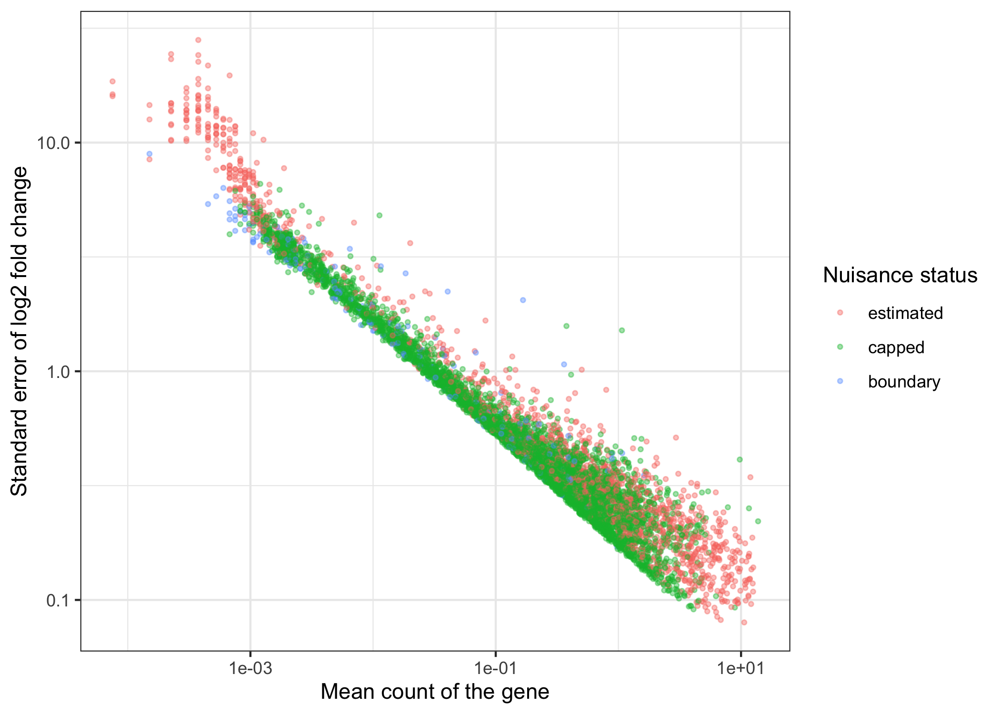
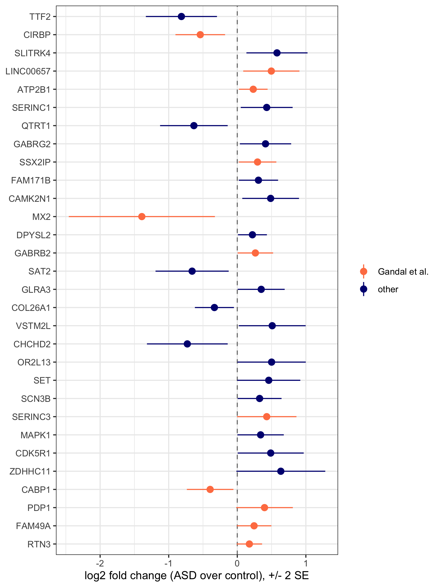
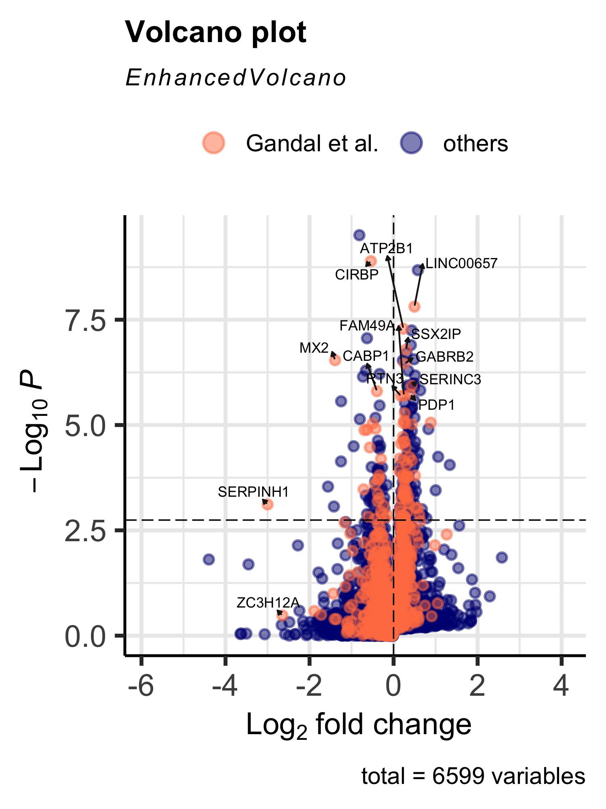
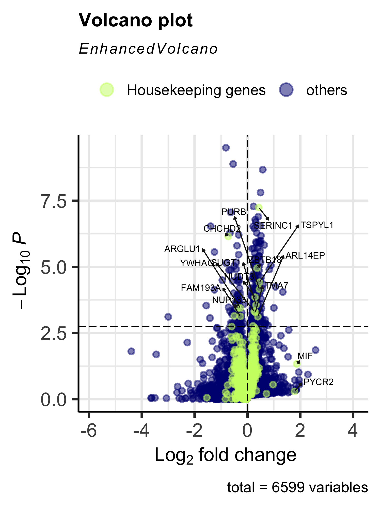
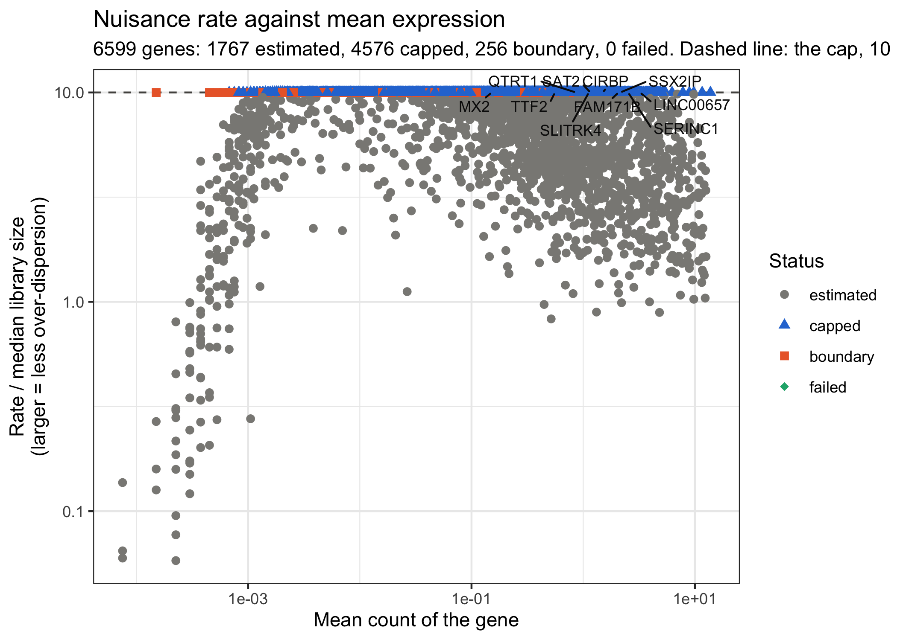
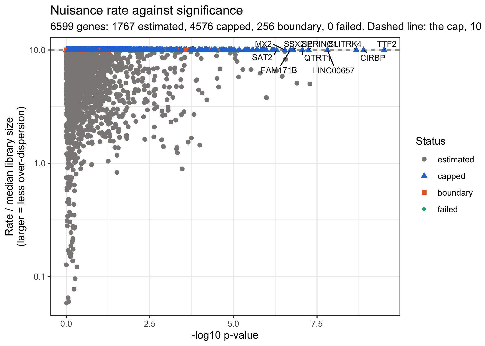
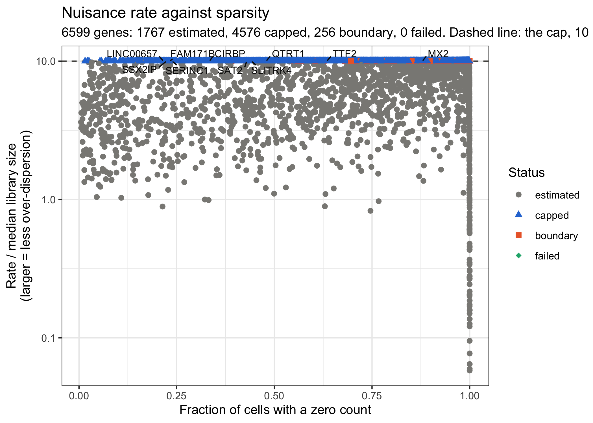
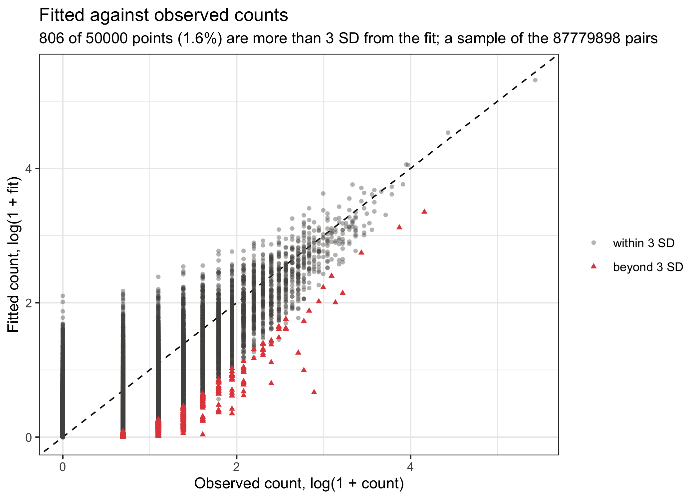
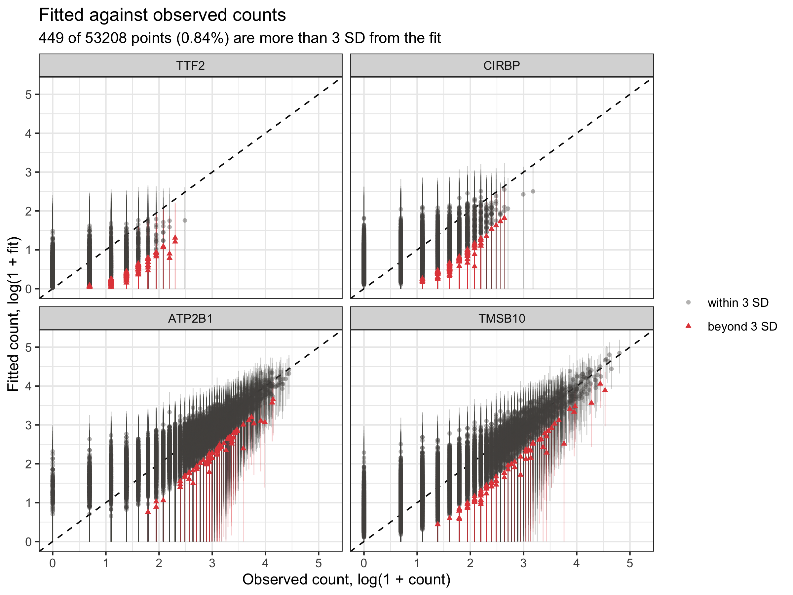

```{r setup, include=FALSE}
knitr::opts_chunk$set(echo = TRUE, message = FALSE, warning = FALSE)
```

# Overview

This article runs eSVD-DE (Lin, Qiu and Roeder, 2024) on a real cohort: the
Layer 2/3 excitatory neurons of Velmeshev et al. (2019), 15 donors with
Autism Spectrum Disorder (ASD) against 16 control donors, on 6,599 genes.
It uses the wrapper `eSVD2::eSVD_helper()`, which runs the whole method in
one call, and then looks at what came out: the log2 fold change of each gene
with its standard error, the volcano plots, and the diagnostic plots of the
over-dispersion estimate. A section at the end explains what every tuning
parameter of the wrapper changes inside the method.

The data set is the one built in
[Neuron preprocessing for eSVD-DE tutorial](https://linnykos.github.io/eSVD2/articles/asd-preprocess.html)
and can be downloaded from
[Dropbox](https://www.dropbox.com/scl/fi/csyz62obxx8xj5gl5sgp4/asd_seurat.RData?rlkey=d7dlhqjesunal52u8z2iomjsg&dl=0).
The file is called `asd_seurat.RData` and contains three variables:

- `asd`: the Seurat object we will be analyzing, 13,302 cells and 6,599 genes (all deemed variable features)
- `date_of_run`: the date when `asd` was constructed
- `session_info`: the session info when `asd` was constructed

Notably, this is **not** the version of the dataset used in the eSVD-DE
paper. The intent of this article is to show how to perform an eSVD-DE
analysis, so the procedure is the typical usage of the method while the
processed data differs from the paper's.

The fit takes about 30 minutes on one core, so the chunks that need it
are not run when the site is built (`eval = FALSE`); their output is pasted
in from a run on 2026-09-30 with eSVD2 1.2.0, and the figures are
pre-rendered. The chunks that only need the packages do run.

| Stage | What it does | Functions |
|---|---|---|
| Load | Load the Seurat object and look at the cohort | `load()`, `table()` |
| Fit and test | Filter the cohort, fit the model, estimate the over-dispersion, compute the posterior and test every gene | `eSVD2::eSVD_helper()` |
| Report | One row per gene: fold change, its standard error, p-value, FDR, nuisance status | `eSVD2::report_results()` |
| Fold change | The fold change and its standard error, on their own and in volcano plots | `ggplot2`, `EnhancedVolcano::EnhancedVolcano()` |
| Diagnostics | Check the over-dispersion estimate and the fit | `eSVD2::plot_nuisance()`, `eSVD2::plot_fitted_vs_observed()`, `eSVD2::recompute_pvalue()` |

Relevant citation:
```
Velmeshev, D., Schirmer, L., Jung, D., Haeussler, M., Perez, Y., Mayer, S., ... & Kriegstein, A. R. (2019). Single-cell genomics identifies cell type-specific molecular changes in autism. Science, 364(6441), 685-689.
```

```{r libraries}
library(Seurat)
library(SeuratObject)
library(eSVD2)
library(ggplot2)
library(EnhancedVolcano)

set.seed(10)
date_of_run <- Sys.time()
session_info <- sessionInfo()
```

# Loading the data

We first load the data. We can use `table()` to see how many cells each donor
contributes and which donors are `ASD` or `Control`.

```{r load_data, eval = FALSE}
load("asd_seurat.RData")
asd
table(asd$individual, asd$diagnosis)
```

```
An object of class Seurat
6599 features across 13302 samples within 1 assay
Active assay: RNA (6599 features, 6599 variable features)
 2 layers present: counts, data
```

```
            ASD Control
indiv_1823    0      72
indiv_4341    0     733
indiv_4849  428       0
indiv_4899  349       0
indiv_5144  202       0
indiv_5163    0     145
indiv_5242    0      81
indiv_5278  944       0
indiv_5294  449       0
indiv_5387    0    1129
indiv_5391    0     237
indiv_5403   69       0
indiv_5408    0     162
indiv_5419  327       0
indiv_5531  631       0
indiv_5538    0     391
indiv_5554    0     233
indiv_5565  881       0
indiv_5577    0     215
indiv_5841  451       0
indiv_5864  275       0
indiv_5879    0     278
indiv_5893    0     976
indiv_5936    0     193
indiv_5939 1016       0
indiv_5945  422       0
indiv_5958    0     826
indiv_5976    0     106
indiv_5978  264       0
indiv_6032    0     289
indiv_6033  528       0
```

The metadata also has each cell's brain region (`region`), each donor's age
and sex, and the capture batch (`Capbatch`) and sequencing batch
(`Seqbatch`) of each cell.

> **Two of these covariates are redundant, and the model refuses them.** In
> these cells each capture batch lies within one sequencing batch, and each
> capture batch comes from one region (the ACC cells are exactly capture
> batches CB3, CB4, CB8 and CB9). Indicators for `region`, `Seqbatch` and
> `Capbatch` together are therefore collinear. eSVD2 1.0 fit such a design
> anyway (its ridge-penalized start spreads the coefficient over the
> collinear columns, and batch columns were never reparameterized); from
> version 1.2.0 `eSVD2::initialize_esvd()` stops and names the redundant
> columns. Below we adjust for `sex` and `Capbatch`, which span the same
> space as the full set; `region` and `Seqbatch` are accounted for through
> the capture batch.

# Running eSVD-DE in one call

We test for differential expression in the mean between the 15 ASD donors
and the 16 control donors among the 6,599 genes. The whole method is one
call to `eSVD2::eSVD_helper()`. The arguments name the columns of
`asd@meta.data` to use:

- `id_var`: the donor, the unit of inference;
- `case_control_var` and `case_control_levels`: the diagnosis, **control
  first, then case** (reversing them flips the sign of every fold change);
- `categorical_vars` and `numerical_vars`: the covariates to adjust for;
- `batch_var_prefix`: a regular expression naming which of the categorical
  covariates are batch variables. Their coefficients are held apart from the
  reparameterization of the fit (see the last section).

Everything else is at its default, including `k = 30` latent dimensions and
the cap on the over-dispersion, `cap_multiplier = 10`. On a single core of a
2023 MacBook Pro (Apple M2 Max, 32 Gb RAM) this took about 30 minutes.
With `verbose = 1` the wrapper prints the stage it is in.

```{r fit, eval = FALSE}
time_start <- Sys.time()
eSVD_obj <- eSVD2::eSVD_helper(
  batch_var_prefix = "Capbatch",
  case_control_levels = c("Control", "ASD"),
  case_control_var = "diagnosis",
  categorical_vars = c("sex", "Capbatch"),
  id_var = "individual",
  numerical_vars = "age",
  seurat_obj = asd,
  k = 30,
  verbose = 1
)
time_end <- Sys.time()

save(eSVD_obj, session_info, date_of_run,
     file = "asd_esvd.RData")
```

The result is an `eSVD` object. With the default `bool_diet = TRUE` it holds
the final fit (`fit_Second`: the latent vectors, the coefficients and the
per-gene nuisance estimates), the per-gene results, and `param`, the record
of every setting, but not the counts or the covariates. It is about
17 Mb in memory. `gene_status` says which genes were analyzed; here
every gene was, because the preprocessing already removed the all-zero
genes.

```{r fit_names, eval = FALSE}
names(eSVD_obj)
table(eSVD_obj$gene_status)
```

```
 [1] "param"         "latest_Fit"    "case_control"  "individual"   
 [5] "fit_Second"    "teststat_vec"  "case_mean"     "control_mean" 
 [9] "case_var"      "control_var"   "log2fc_vec"    "log2fc_se_vec"
[13] "pvalue_list"   "gene_status"  
```

```
analyzed all_zero 
    6599        0 
```

# Reporting the results

`eSVD2::report_results()` collects the results into a data frame with one
row per gene: the log2 fold change (`logFC`, the log2 of the ratio of the
case donors' mean to the control donors' mean), its standard error
(`logFC_se`), the p-value on three scales (`log10pvalue` is minus its log10,
which keeps the ranking when `pvalue` underflows to 0), the
Benjamini-Hochberg adjusted p-value (`pvalue_adj`) and `nuisance_status`,
what the over-dispersion estimate did with the gene (see the diagnostics
section). Ranking by `log10pvalue` gives the most significant genes.

```{r report, eval = FALSE}
result_df <- eSVD2::report_results(eSVD_obj)
result_df <- result_df[order(result_df$log10pvalue, decreasing = TRUE), ]
print(utils::head(result_df, 15), digits = 3)
sum(result_df$pvalue_adj <= 0.05)
```

```
              genes  logFC logFC_se log10pvalue   pvalue pvalue_adj nuisance_status
TTF2           TTF2 -0.815    0.259        9.51 3.11e-10   2.05e-06          capped
CIRBP         CIRBP -0.540    0.181        8.89 1.29e-09   4.24e-06          capped
SLITRK4     SLITRK4  0.579    0.223        8.68 2.11e-09   4.64e-06          capped
LINC00657 LINC00657  0.496    0.205        7.81 1.55e-08   2.55e-05          capped
ATP2B1       ATP2B1  0.233    0.105        7.29 5.17e-08   6.23e-05       estimated
SERINC1     SERINC1  0.429    0.189        7.25 5.66e-08   6.23e-05          capped
QTRT1         QTRT1 -0.633    0.247        7.06 8.68e-08   8.19e-05          capped
GABRG2       GABRG2  0.412    0.187        6.90 1.26e-07   1.04e-04       estimated
SSX2IP       SSX2IP  0.295    0.137        6.79 1.63e-07   1.19e-04          capped
FAM171B     FAM171B  0.308    0.143        6.70 1.98e-07   1.30e-04          capped
CAMK2N1     CAMK2N1  0.486    0.207        6.56 2.75e-07   1.48e-04       estimated
MX2             MX2 -1.392    0.533        6.54 2.90e-07   1.48e-04          capped
DPYSL2       DPYSL2  0.221    0.106        6.54 2.91e-07   1.48e-04       estimated
GABRB2       GABRB2  0.264    0.129        6.46 3.47e-07   1.64e-04       estimated
SAT2           SAT2 -0.659    0.267        6.29 5.10e-07   2.12e-04          capped
```

```
[1] 243
```

243 of the 6,599 genes are significant at FDR 0.05 (336 at FDR 0.10). The
most significant gene, `TTF2`, is lower in the ASD donors by a factor of
about 1.8 (a log2 fold change of -0.81); 22 of the 30 most significant genes
are higher in ASD. Notice the last column: most of the top genes had their
over-dispersion capped, which the diagnostics section returns to.

# The log fold change and its standard error

From version 1.1.0 every analysis reports, for each gene, the log2 fold
change between the case and the control donors and a standard error for it.
Both are stored on the object as `eSVD_obj$log2fc_vec` and
`eSVD_obj$log2fc_se_vec`, and `report_results()` copies them into `logFC`
and `logFC_se`. Three things to know about the standard error:

- It is a delta-method standard error of `log2(case_mean / control_mean)`,
  built from the two per-arm variances that the test statistic divides by,
  and it is divided by the number of **donors** in each arm, not the number
  of cells. That puts it on the same footing as the standard error of a
  pseudobulk method such as DESeq2, dreamlet or NEBULA.
- `logFC / logFC_se` is not the statistic behind `pvalue`. The test is
  computed on the linear scale and calibrated with an empirical null across
  genes, so a gene's p-value and its fold-change interval do not have to
  agree exactly.
- It accounts for the variation between donors and within donors given the
  fit, but not for the uncertainty of the fit itself. See
  `?eSVD2::compute_log_fold_change` for the details.

The first figure draws the standard error against the gene's mean count,
colored by `nuisance_status`. The standard error falls with the mean count, from about 10 on the log2
scale for the rarest genes to about 0.1 for the most expressed, and at a
given count it depends little on whether the rate was estimated or capped.
The genes at the boundary (no finite maximum-likelihood rate) have a larger
standard error for their count than the others.

```{r logfc_se, eval = FALSE}
fit <- eSVD_obj[[eSVD_obj$latest_Fit]]
se_df <- data.frame(
  gene = names(eSVD_obj$log2fc_se_vec),
  mean_count = fit$gene_mean_count_vec[names(eSVD_obj$log2fc_se_vec)],
  log2fc_se = eSVD_obj$log2fc_se_vec,
  nuisance_status = fit$nuisance_status[names(eSVD_obj$log2fc_se_vec)]
)
plot1 <- ggplot2::ggplot(se_df, ggplot2::aes(x = mean_count,
                                             y = log2fc_se,
                                             color = nuisance_status))
plot1 <- plot1 + ggplot2::geom_point(alpha = 0.4, size = 0.8)
plot1 <- plot1 + ggplot2::scale_x_log10() + ggplot2::scale_y_log10()
plot1 <- plot1 + ggplot2::labs(x = "Mean count of the gene",
                               y = "Standard error of log2 fold change",
                               color = "Nuisance status")
plot1 <- plot1 + ggplot2::theme_bw()
plot(plot1)
```

```{r logfc_se_figure, out.width = "600px", fig.align="center", echo = FALSE, fig.cap=c("Standard error of the log2 fold change against the gene's mean count")}

```

The second figure is a forest plot of the 30 most significant genes: the
log2 fold change with an interval of plus or minus two standard errors,
with the genes that Gandal et al. (2022) found differentially expressed in
bulk ASD cortex in a different color. Eleven of the 30 are Gandal et al. genes. For these 30 genes the interval
excludes zero, but that is not true of the significant genes as a whole:
for 87 percent of the 243 genes at FDR 0.05, the interval of plus or minus
two standard errors covers zero. The two answer different questions. The
p-value comes from the Welch statistic after the empirical null has
recentered and rescaled it across genes (here the null was estimated to have
mean -0.15 and standard deviation 0.42 on the Gaussian scale, so the
statistics are spread more tightly than a standard normal and the
calibration makes more genes significant), while the interval takes the
fold change and its standard error at face value.

```{r logfc_forest, eval = FALSE}
data("gandal_df", package = "eSVD2")
gandal_genes <- gandal_df[which(gandal_df[, "WholeCortex_ASD_FDR"] <= 0.05),
                          "external_gene_name"]
gandal_genes <- intersect(gandal_genes, result_df$genes)

top_df <- result_df[seq_len(30), ]
top_df$gene_set <- ifelse(top_df$genes %in% gandal_genes,
                          "Gandal et al.", "other")
top_df$genes <- factor(top_df$genes, levels = rev(top_df$genes))
plot1 <- ggplot2::ggplot(top_df, ggplot2::aes(x = genes,
                                              y = logFC,
                                              color = gene_set))
plot1 <- plot1 + ggplot2::geom_hline(yintercept = 0, linetype = "dashed",
                                     color = "gray50")
plot1 <- plot1 + ggplot2::geom_pointrange(
  ggplot2::aes(ymin = logFC - 2 * logFC_se, ymax = logFC + 2 * logFC_se)
)
plot1 <- plot1 + ggplot2::coord_flip()
plot1 <- plot1 + ggplot2::scale_color_manual(
  values = c("Gandal et al." = "coral", "other" = "navy")
)
plot1 <- plot1 + ggplot2::labs(
  x = NULL,
  y = "log2 fold change (ASD over control), +/- 2 SE",
  color = NULL
)
plot1 <- plot1 + ggplot2::theme_bw()
plot(plot1)
```

```{r logfc_forest_figure, out.width = "500px", fig.align="center", echo = FALSE, fig.cap=c("The 30 most significant genes: log2 fold change with +/- 2 standard errors")}

```

# Volcano plots

To visualize the p-values, we plot a volcano plot where the x-axis is the
stored log2 fold change and the y-axis the negative log10 p-value. The
dotted horizontal line is the p-value at the FDR cutoff of 0.05.

To give the volcano plot some biological interpretation, we mark the genes
found in Gandal et al. (see
[https://www.nature.com/articles/s41586-022-05377-7](https://www.nature.com/articles/s41586-022-05377-7)).
That study was based on bulk sequencing of brain regions, where possibly
many cell types are involved in the DEG analysis. Nonetheless, we would
expect a good number of the DEGs of Gandal et al. to be highly significant
in our analysis, which is what the volcano plot shows: 83 of the 1,322 Gandal et al. genes present are significant at FDR 0.05
(6.3 percent, against 3.7 percent of all genes), and 11 of the 30 most
significant genes are among them.

```{r volcano, eval = FALSE}
volcano_df <- data.frame(
  gene = result_df$genes,
  lfc = result_df$logFC,
  pvalue = pmax(result_df$pvalue, 1e-300) # EnhancedVolcano needs p > 0
)
pCutoff <- max(volcano_df$pvalue[which(result_df$pvalue_adj <= 0.05)])

volcano_df2 <- volcano_df[c(which(!volcano_df$gene %in% gandal_genes),
                            which(volcano_df$gene %in% gandal_genes)), ]
colCustom <- sapply(volcano_df2$gene, function(gene){
  ifelse(gene %in% gandal_genes, "coral", "navy")
})
names(colCustom)[colCustom == "coral"] <- "Gandal et al."
names(colCustom)[colCustom == "navy"] <- "others"

EnhancedVolcano::EnhancedVolcano(
  volcano_df2,
  lab = volcano_df2$gene,
  selectLab = gandal_genes,
  colCustom = colCustom,
  x = "lfc",
  y = "pvalue",
  ylim = c(0, max(result_df$log10pvalue)),
  labSize = 3,
  pCutoff = pCutoff,
  FCcutoff = 0,
  drawConnectors = TRUE
)
```

```{r volcano_figure, out.width = "600px", fig.align="center", echo = FALSE, fig.cap=c("Volcano plot of the eSVD-DE analysis, highlighting the Gandal et al. genes")}

```

Alternatively, we can highlight the housekeeping genes, which act as a rough
negative control: we would not expect many of them to differ between case
and control donors. 16 of the 942 housekeeping genes present are significant at FDR 0.05 (1.7
percent, against 3.7 percent of all genes).

```{r volcano_hk, eval = FALSE}
data("housekeeping_df", package = "eSVD2")
hk_genes <- intersect(housekeeping_df[, "Gene"], result_df$genes)

volcano_df2 <- volcano_df[c(which(!volcano_df$gene %in% hk_genes),
                            which(volcano_df$gene %in% hk_genes)), ]
colCustom <- sapply(volcano_df2$gene, function(gene){
  ifelse(gene %in% hk_genes, "darkolivegreen1", "navy")
})
names(colCustom)[colCustom == "darkolivegreen1"] <- "Housekeeping genes"
names(colCustom)[colCustom == "navy"] <- "others"

EnhancedVolcano::EnhancedVolcano(
  volcano_df2,
  lab = volcano_df2$gene,
  selectLab = hk_genes,
  colCustom = colCustom,
  x = "lfc",
  y = "pvalue",
  ylim = c(0, max(result_df$log10pvalue)),
  labSize = 3,
  pCutoff = pCutoff,
  FCcutoff = 0,
  drawConnectors = TRUE
)
```

```{r volcano_hk_figure, out.width = "600px", fig.align="center", echo = FALSE, fig.cap=c("Volcano plot of the eSVD-DE analysis, highlighting the housekeeping genes")}

```

# Diagnostics of the over-dispersion

The over-dispersion of each gene decides how much that gene's posterior
follows the fit rather than the observed counts, so it is worth a look
before the results are used. The estimate is stored as a Gamma *rate*
(`nuisance_vec` in the fit), the reciprocal of the over-dispersion: a larger
rate means counts closer to Poisson around the fit. **No gene's rate is
allowed above `cap_multiplier` (default 10) times the median of its library
size.** A gene whose counts are no more variable around the fit than a
Poisson has no finite maximum-likelihood rate; without the cap it would get
an enormous rate and an inflated test statistic. What the estimate did with
each gene is its `nuisance_status`: `estimated` (the maximum-likelihood rate
was kept), `capped` (a finite rate existed but was above the cap),
`boundary` (no finite rate existed; the gene is set to the cap) or `failed`.

```{r nuisance_status, eval = FALSE}
table(fit$nuisance_status)
eSVD_obj$param$nuisance_num_capped
```

```
estimated    capped  boundary    failed 
     1767      4576       256         0 
```

```
[1] 4832
```

**On this cohort the cap acts on most genes**: 4,576 are capped and 256 are
at the boundary, 73 percent of the genes, where in the simulated data on
which the default of 10 was chosen about 11 percent were. The share falls
with expression, from about 80 percent in the lowest third of the genes by
mean count to 60 percent in the highest third, and the boundary genes are
almost all lowly expressed. Among the 243 significant genes, 164 are capped
or at the boundary. In other words, around a rank-30 fit the counts of most
of these genes are close to Poisson, and it is the cap rather than the
likelihood that sets their rate. Whether the default cap is right for a
cohort like this, or whether a smaller `k` would leave more over-dispersion
in the residual, is a question this article does not settle; the end of
this section shows how far the results move with the cap.

**The rate of each gene against three summaries of the gene.**
`eSVD2::plot_nuisance()` draws the rate divided by the gene's median library
size, which puts every gene in the same units, against the gene's mean
count, its significance or its sparsity. The dashed line is the cap, and the
genes it acted on sit on it; the most significant genes are labeled. What to
look for: most genes should be below the line, the genes at the line should
be the lowly expressed and sparse ones, and they should not make up the most
significant genes. It needs neither the counts nor the covariates, so it
works on the diet object as is.

```{r plot_nuisance, eval = FALSE}
plot1 <- eSVD2::plot_nuisance(input_obj = eSVD_obj,
                              x_axis = "mean_expression")
plot(plot1)
plot1 <- eSVD2::plot_nuisance(input_obj = eSVD_obj,
                              x_axis = "log10pvalue")
plot(plot1)
plot1 <- eSVD2::plot_nuisance(input_obj = eSVD_obj,
                              x_axis = "sparsity")
plot(plot1)
```

```{r nuisance_expression_figure, out.width = "600px", fig.align="center", echo = FALSE, fig.cap=c("Each gene's nuisance rate, in units of its median library size, against its mean count")}

```

```{r nuisance_pvalue_figure, out.width = "600px", fig.align="center", echo = FALSE, fig.cap=c("The same rates against each gene's -log10 p-value")}

```

```{r nuisance_sparsity_figure, out.width = "600px", fig.align="center", echo = FALSE, fig.cap=c("The same rates against each gene's sparsity (the share of cells with a zero count)")}

```

The pattern here is not the one the diagnostic asks for. The genes at the
cap are the well-expressed ones, and every one of the ten most significant
genes is at the cap; the genes below the line are the rarely expressed ones,
whose rate falls with the mean count. The estimate is in units of the gene's
median library size, which is tiny for a gene seen in few cells, so those
low rates are the genes for which the counts do carry information about
the over-dispersion. The message of the three plots is that the choice of
`cap_multiplier` matters on this cohort.

**The fitted count against the observed count.** In
`eSVD2::plot_fitted_vs_observed()` each point is one cell and one gene (a
random sample of `max_points` pairs), and a point is red when its count is
more than `num_sd = 3` standard deviations from its fit, the standard
deviation being the one the model implies for that gene's over-dispersion.
The points should follow the dashed line, and only a small share should be
red: on counts drawn from the model at their true rates, 1 to 2 percent of
pairs are beyond 3 standard deviations (a count is right-skewed), a rate ten
times too large gives about 5 percent, and a rate ten times too small under
0.1 percent. Because the diet object has no counts, we pass the Seurat
object; the counts and covariates are rebuilt from it and checked against
the fit.

```{r plot_fitted, eval = FALSE}
plot1 <- eSVD2::plot_fitted_vs_observed(input_obj = eSVD_obj,
                                        seurat_obj = asd,
                                        max_points = 50000)
mean(plot1$data$bool_outside)
plot(plot1)
```

```
[1] 0.01612
```

```{r fitted_figure, out.width = "600px", fig.align="center", echo = FALSE, fig.cap=c("Fitted against observed counts for 50,000 random cell-gene pairs; red points are beyond 3 standard deviations")}

```

The argument `genes` draws every cell of the genes named, one panel per gene,
and `bool_draw_bars = TRUE` adds each point's interval of 3 standard
deviations around its fit. Bars that are too short to reach the line mean
the over-dispersion is underestimated for that gene; bars that reach far
past it for nearly every point mean it is overestimated. Here we draw the two
most significant genes, the most expressed housekeeping gene and the most
significant gene whose rate was capped.

```{r plot_fitted_genes, eval = FALSE}
capped_genes <- result_df$genes[result_df$nuisance_status %in%
                                  c("capped", "boundary")]
hk_top <- hk_genes[which.max(fit$gene_mean_count_vec[hk_genes])]
genes_panel <- c(result_df$genes[1:2], hk_top, capped_genes[1])
genes_panel
plot1 <- eSVD2::plot_fitted_vs_observed(input_obj = eSVD_obj,
                                        seurat_obj = asd,
                                        genes = genes_panel,
                                        bool_draw_bars = TRUE)
plot(plot1)
```

```
[1] "TTF2"   "CIRBP"  "ATP2B1" "TMSB10"
```

```{r fitted_genes_figure, out.width = "700px", fig.align="center", echo = FALSE, fig.cap=c("Fitted against observed counts for four genes, every cell, with 3-standard-deviation bars")}

```

Because a capped gene's rate is the largest the cap allows, its standard
deviation is close to the Poisson one, and `TTF2` and `CIRBP` (both capped)
have the shortest bars; `ATP2B1`, an estimated gene with a rate of 5 times
its median library size, has wider ones, as does the housekeeping gene
`TMSB10` (rate 7.4). In all four panels the bars reach the line for nearly
every cell, and 0.84 percent of the 53,208 cells are beyond 3 standard
deviations, so the variance the model assigns to these genes describes
their counts.

**Redoing the test at another cap.** The factorization does not depend on
the cap, so the test can be redone at another `cap_multiplier` without
fitting again, with `eSVD2::recompute_pvalue()`. `cap_multiplier = 1` is
close to the behavior of the version of eSVD2 that accompanied the paper,
and `Inf` removes the cap. As with the fitted-versus-observed plot, the diet
object needs the Seurat object to rebuild the counts.

```{r recompute, eval = FALSE}
cap_summary <- lapply(c(1, 10, Inf), function(cap){
  if(cap == 10){
    obj <- eSVD_obj
  } else {
    obj <- eSVD2::recompute_pvalue(input_obj = eSVD_obj,
                                   cap_multiplier = cap,
                                   seurat_obj = asd)
  }
  data.frame(
    cap_multiplier = cap,
    num_capped = obj$param$nuisance_num_capped,
    num_fdr05 = sum(obj$pvalue_list$fdr_vec <= 0.05, na.rm = TRUE),
    cor_teststat = stats::cor(eSVD_obj$teststat_vec, obj$teststat_vec,
                              use = "complete.obs")
  )
})
do.call(rbind, cap_summary)
```

```
  cap_multiplier num_capped num_fdr05 cor_teststat
1              1       6537       516    0.9715284
2             10       4832       243    1.0000000
3            Inf          0       307    0.8807407
```

With `cap_multiplier = 1` nearly every gene is capped (6,537) and 516 genes
are significant at FDR 0.05. Without a cap 307 are, but only 143 of those
are among the 243 of the default, and the Welch statistics correlate at
0.88 with the default's. The number of discoveries is therefore not
monotone in the cap, and the set of discoveries moves with it. In the
simulations behind the default, the false discoveries were flat for
`cap_multiplier` between 1 and 10; this cohort is a reminder that on real
data the cap is a tuning parameter to report alongside the results.

# What each tuning parameter does

`eSVD2::eSVD_helper()` passes most of its arguments to `eSVD2::eSVD()`, which
runs the stages of the method in order. This section walks through the
arguments stage by stage and says what each one changes inside the method.
The model is worth keeping in mind: the count of gene $j$ in cell $i$ is
modeled as $A_{ji} \mid \lambda_{ji} \sim \text{Poisson}(\ell_{ji} \lambda_{ji})$
with $\lambda_{ji} \sim \text{Gamma}(\text{mean} = \mu_{ji}, \text{var} = \mu_{ji} / \beta_j)$,
where $\mu_{ji} = \exp(Y_j^\top X_i + Z_{j,cc} C_{i,cc})$ is the low-rank
"predictable" expression plus the case-control effect, $\ell_{ji}$ is the
covariate-adjusted library size, and $\beta_j$ is the gene's nuisance rate
(the reciprocal of its over-dispersion). The defaults are the values in
parentheses; the analysis above used every default (`k = 30` was passed
explicitly, and 30 is also its default).

## Which cells and individuals are analyzed (`eSVD_helper()` only)

These five thresholds are applied by `eSVD2::filter_cohort()` before anything
is fitted. `eSVD2::eSVD()` itself refuses a cohort that violates them rather
than filtering it, so a mistake here fails loudly.

- `min_cells_per_id` (3): every individual with fewer cells is dropped, with a
  warning naming them. An individual with one or two cells has no usable
  within-individual variance, and that variance is what the test divides by.
  It must be `0` (off) or at least `3`.
- `min_cells` (20), `min_cells_casecontrol` (20), `min_ids` (4),
  `min_ids_per_arm` (2): if the cohort left after the drop has this many cells
  or fewer, either arm has this many cells or fewer, this many individuals or
  fewer, or either arm has fewer than this many individuals, the cohort is
  rejected and `eSVD_helper()` returns `NA` with a warning saying which
  threshold fired. Two individuals per arm is the smallest number for which
  the Welch degrees of freedom exist.

`eSVD_helper()` also removes every gene whose counts are all zero in the
filtered cohort, fits the rest, and puts the removed genes back with `NA`
estimates and a p-value of 1; `eSVD_obj$gene_status` records which is which.

## Which covariates enter the model

- `id_var`: the column naming each cell's individual. The individual is the
  unit of inference: the test compares the case individuals with the control
  individuals, never cells with cells. The individual is **not** added as a
  covariate (its indicators would be collinear with every individual-level
  covariate).
- `case_control_var` and `case_control_levels`: the column holding the
  diagnosis and its two levels, **control first, then case**. The case
  indicator becomes the covariate whose coefficient $Z_{j,cc}$ is the
  case-control effect; reversing the levels flips the sign of every fold
  change and statistic.
- `categorical_vars`: each is one-hot encoded with its most frequent level as
  the reference (that level gets no column); a variable with a single level is
  dropped. The resulting columns must be linearly independent, or
  `initialize_esvd()` stops and names the redundant ones (see the callout
  above).
- `numerical_vars`: each is divided by its root mean square, so that a
  covariate recorded in years and one recorded in months give the same fit.
- `batch_var_prefix`: a regular expression; the covariates whose names match
  it are treated as batch variables. Their coefficients are estimated like any
  other, but they are left out of the reparameterization step (next
  paragraph), so the latent factors are never made orthogonal to them.
- `Log_UMI`, the log of each cell's total count, is always added as a
  covariate. It is the only covariate whose coefficient is left out of the
  first two reparameterizations (it is freed before the last one), because it
  carries the sequencing depth and we do not want it mixed with correlated
  covariates early in the fit.

The reparameterization (`eSVD2::reparameterization_esvd_covariates()`) runs
after the initialization and after each round of optimization. It makes the
cell latent vectors $X$ orthogonal to the covariates $C$ and then to each other,
by moving whatever part of $XY^\top$ is explained by $C$ into $ZC^\top$. Without
it the split between "low-rank structure" and "covariate effects" is not
identifiable, and the case-control coefficient could be absorbed by the
latent factors.

## The low-rank fit

- `k` (30): the number of latent dimensions, that is, the rank of the
  predictable expression $XY^\top$ across genes. It is the one parameter we
  suggest thinking about for a new dataset. Too small, and structure that is
  shared across genes (cell states, continuous gradients) ends up in the
  residual, where it inflates the nuisance rate and the within-individual
  variance. Too large, and the fit follows noise, which the posterior below
  partly undoes but not entirely. It must not exceed the number of genes.
- `bool_intercept` (`TRUE`): whether each gene gets its own intercept. Leave
  it on.
- `lambda` (0.1): the ridge penalty of the per-gene Poisson regression that
  gives the starting coefficients $Z$ (`eSVD2::initialize_esvd()`; the
  starting $X$ and $Y$ come from an SVD of the residual on the `log1p` scale).
  It changes only the starting point, but the objective is not convex, so a
  different start can reach a different fit.
- `l2pen` (0.1): the L2 penalty on $X$, $Y$ and $Z$ during the alternating
  Newton optimization (`eSVD2::opt_esvd()`). Larger values shrink the latent
  vectors and coefficients toward zero and make the fit smoother and the
  optimization better conditioned.
- `max_iter` (100) and `tol` (1e-6): each round of `opt_esvd()` alternates
  between updating the cells' latent vectors and the genes' latent vectors
  and coefficients until the objective changes by less than `tol` (relative
  to its size) or `max_iter` passes are used. `eSVD()` runs two rounds: in the
  first every covariate coefficient except the case-control one is held at its
  initial value, so that the latent factors and the case-control effect absorb
  as much as they can; in the second all coefficients are free.

## The nuisance (over-dispersion) estimate

`eSVD2::estimate_nuisance()` estimates one rate $\beta_j$ per gene by maximum
likelihood, given the fit. The rate is the reciprocal of the over-dispersion,
so a larger rate means counts closer to Poisson around the fit.

- `cap_multiplier` (10): no gene's rate may exceed this many times the median
  over cells of its library size, and `Inf` removes the bound. A gene whose
  counts are no more variable around the fit than a Poisson has no finite
  maximum-likelihood rate; without a bound it would receive an enormous rate,
  its posterior (below) would follow the fit exactly, and its test statistic
  would be inflated. The bound is a calibration device rather than an
  estimate, and `nuisance_status` says which genes it acted on. The
  factorization does not depend on it, so `eSVD2::recompute_pvalue()` can
  change it afterwards without fitting again.
- `bool_covariates_as_library` (`TRUE`): whether the effects of the donor
  covariates (every covariate except the case-control one) count as part of
  the library size $\ell_{ji}$, and so as part of the depth that the posterior
  and the test adjust for, or as part of the expression $\mu_{ji}$ that is
  being compared. With `TRUE`, a difference in sex or batch is treated like a
  difference in depth and is removed; the case-control effect stays in
  $\mu_{ji}$ either way. The same value is used by the nuisance estimate, the
  posterior and the test, so that all three see the same library.
- `bool_library_includes_interept` (`TRUE`): whether the gene's intercept is
  part of the library size as well. With `TRUE` the rate is measured relative
  to the gene's typical count, which is what the cap's units assume.
- `bool_use_log` (`FALSE`): whether the rate is optimized on the log scale.
  This changes the numerical route, not the estimand; the log route is a
  fallback for genes where the first route fails.

## The posterior

For each cell and gene, `eSVD2::compute_posterior()` (or the fused
`eSVD2::compute_test_per_gene()` when `bool_diet = TRUE`) combines the count
with the fit through the Gamma-Poisson posterior: the posterior mean is
$(A_{ji} + \beta_j \mu_{ji}) / (\ell_{ji} + \beta_j)$, a weighted average of
the observed count per unit of depth and the fitted expression, where the
weight on the fit is the rate. This is what stops the pooling across genes
from inflating the Type-1 error: a gene with a small rate (a lot of
over-dispersion) trusts its own counts, and a gene with a large rate trusts
the fit, at most `cap_multiplier` times as much as the observed depth.

- `alpha_max` (`NULL`, meaning twice the largest count): a ceiling on the
  fitted expression $\mu_{ji}$ before it enters the posterior, so that a cell
  where the fit diverged cannot dominate an individual's mean.
- `library_min` (0.1): a floor on the library size $\ell_{ji}$, so that a cell
  with a very small fitted depth does not get an enormous posterior variance.
- `pseudocount` (0): a constant added to every count before the posterior.
- `bool_stabilize_underdispersion` (`TRUE`): if the geometric mean of the
  rates is above 1 (in the units of the library size), every gene's rate is
  divided by that mean so that the geometric mean becomes 1. This keeps the
  posterior from collapsing onto the fit for every gene at once when the rates
  are large across the board; it changes every gene's posterior by the same
  factor, and only the relative rates matter for the ranking of genes.
- `bool_adjust_covariates` (`FALSE`): experimental; divides the posterior mean
  by the donor covariates' effects. It cannot be combined with
  `bool_covariates_as_library = TRUE`, and we have not found a case where it
  helps.

## The test

`eSVD2::compute_test_statistic()` averages the posterior means and variances
of each individual's cells, treats each arm as a mixture of its individuals,
and forms a Welch two-sample statistic for the difference in mean expression
between the case and the control individuals. `eSVD2::compute_pvalue()`
turns it into a p-value with Welch degrees of freedom, maps it to a Gaussian
scale, fits an empirical null across genes (`locfdr`), and adjusts with
Benjamini-Hochberg.

- `min_cells_per_individual` (3): an individual with fewer cells is an
  error at the test, not a silently noisy statistic. `eSVD_helper()` already
  dropped such individuals with `min_cells_per_id`, so it only matters when
  `eSVD()` is called directly; `0` disables the check.

## What is kept

- `bool_diet` (`TRUE`): compute the posterior, the statistic and the p-value
  one gene at a time without ever holding the cell-by-gene posterior matrices,
  and drop the counts, the covariates and the two intermediate fits from the
  returned object. The final fit and every per-gene result are kept. A diet
  object cannot draw `plot_fitted_vs_observed()` or run `recompute_pvalue()`
  on its own; pass the Seurat object to them, and the counts and covariates
  are rebuilt and checked against the fit.
- `intermediate_save` (`NULL`): a file path at which the object is saved after
  each stage, for a run that may not finish.
- `verbose` (0): `1` prints the stage being run, `2` the iterations within it.

# What we glossed over

- **The choice of `k`.** We used the default of 30 latent dimensions, as in
  the paper. The last section says what it trades off; we have not swept it
  on this cohort.
- **The covariates.** The full set of the metadata (`region`, `Seqbatch`,
  `Capbatch`) is collinear in these cells, and we kept the capture batch.
  Whether region should be adjusted for as biology rather than absorbed by
  the batch is a modeling choice this article does not settle.
- **The stage-by-stage pipeline.** `eSVD_helper()` calls
  `eSVD2::format_covariates()`, `eSVD2::initialize_esvd()`, two rounds of
  `eSVD2::opt_esvd()` with `eSVD2::reparameterization_esvd_covariates()`
  after each, `eSVD2::estimate_nuisance()`, and then the posterior and the
  test. The package vignette
  [eSVD-DE Overview](https://linnykos.github.io/eSVD2/articles/eSVD2.html)
  runs those calls one at a time on simulated data. We ran that pipeline on this cohort as well, with the same settings: its
Welch statistics correlate with the wrapper's at 0.9999, and 243 of its 245
genes at FDR 0.05 are the wrapper's 243.
- **The empirical null.** `eSVD2::compute_pvalue()` calibrates the
  Gaussianized statistics with `locfdr`; `eSVD_obj$pvalue_list$method`
  records which estimator ran (`locfdr` here).

# References

- Velmeshev, D., Schirmer, L., Jung, D., Haeussler, M., Perez, Y., Mayer,
  S., ... & Kriegstein, A. R. (2019). Single-cell genomics identifies cell
  type-specific molecular changes in autism. *Science*, 364(6441), 685-689.
  [doi:10.1126/science.aav8130](https://doi.org/10.1126/science.aav8130)
- Gandal, M. J., Haney, J. R., Wamsley, B., Yap, C. X., Parhami, S., Emani,
  P. S., ... & Geschwind, D. H. (2022). Broad transcriptomic dysregulation
  occurs across the cerebral cortex in ASD. *Nature*, 611(7936), 532-539.
  [doi:10.1038/s41586-022-05377-7](https://doi.org/10.1038/s41586-022-05377-7)
- Lin, K. Z., Qiu, Y., & Roeder, K. (2024). eSVD-DE: cohort-wide
  differential expression in single-cell RNA-seq data using exponential-family
  embeddings. *BMC Bioinformatics*, 25, 113.
  [doi:10.1186/s12859-024-05724-7](https://doi.org/10.1186/s12859-024-05724-7)

# Setup

The following shows the package versions that the developer (GitHub username:
linnykos) used when this article was rendered.

```{r session_info}
sessionInfo()
```
